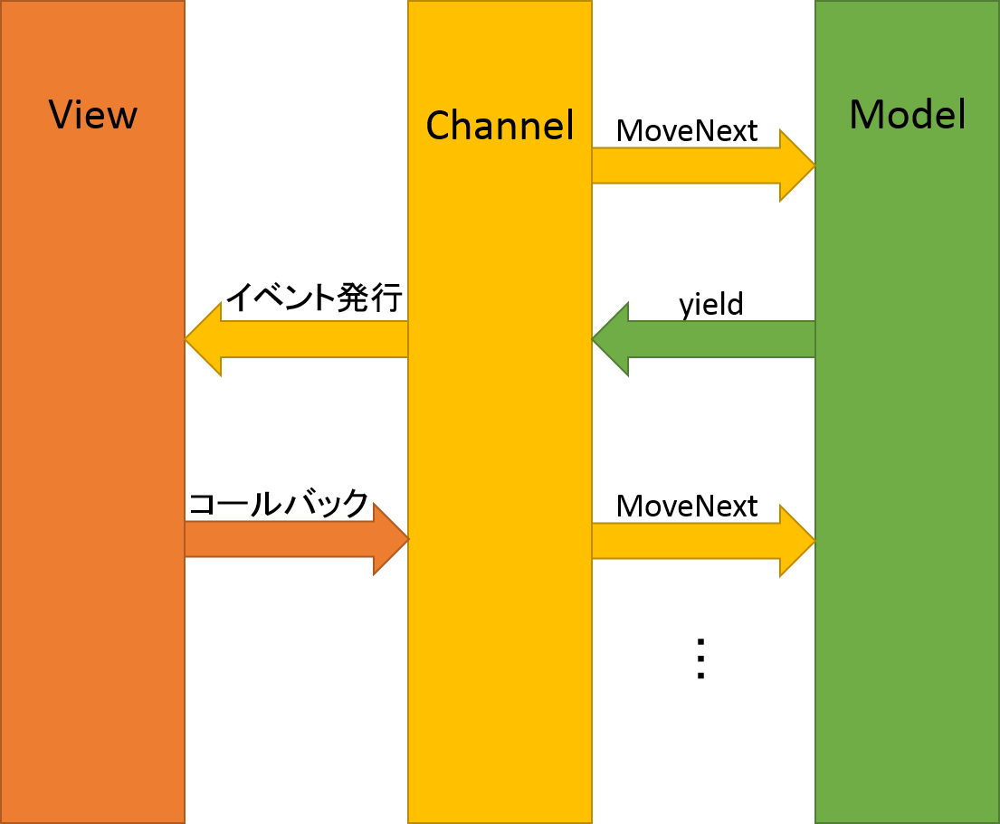

#コルーチンを使ったゲームフロー管理
##概要
「冒険者は森に強い」のソースコードでは、コルーチンを使ってゲームフローを記述しています。ここでその実装について解説します。設計の意図はともかく、とりあえずコードが読みやすくなります。

[コルーチンについてはこちら](http://www.slideshare.net/amusementcreators/ss-16019639)

主な考え方は[岩永さんのスライド](http://www.slideshare.net/ufcpp/interaction-channel?qid=147e6eb3-a350-4490-8b3b-01c9c8aa3e11&v=qf1&b=&from_search=1)に登場する「Interaction Channel」と同じです。

##モデルとビュー
ソースコードは「モデル」側プロジェクトと「ビュー」側プロジェクトに分かれています。モデル側にはゲームの流れを制御する中核的なコードが、ビュー側にはゲームの見た目と動きを制御する表面的なコードが書かれています。こうすることによってゲームの中核と見た目のコードを分離し、プログラマの考えを整理したり、見た目の変更を容易にしたり、コードの再利用性を高める効果があります。

そして、ソースコードには「SteppingChannel」というクラスが登場します。このクラスによってモデルとビューが繋げられます。このクラスは、次の図のようにモデル側やビュー側と通信します。



モデル側ではコルーチンで制御されており、`yield return new Message()`というコードでメッセージをビュー側に送り、ビュー側の応答を待機します。ビュー側では、コールバック デリゲートを呼び出すことでモデルのコルーチンの処理を再開させます。


このクラスの使い方は次のとおりです。

###初期化
* ChannelにModel側のフローが記述されたコルーチンを渡す。
* `Channel.AddMessageHandler`メソッドによってViewのメソッドをメッセージに紐付ける。

###更新
Main関数内で、毎フレーム、ChannelをUpdateしています。Model,Channel,Viewは次の流れで動作します。

1. Channelは通常状態でUpdateされると、Modelのコルーチンの処理を進める。
2. Modelはゲームの流れを進め、出力やユーザー入力の待機をする場合に`yield`で一旦処理を抜ける。
3. Channelはコルーチンから返ってきたメッセージに紐付いたViewのメソッドを呼び出し、待機状態になる。
4. ViewはChannelから渡されたメッセージに基いて見た目を変化させたり、ユーザーの入力を受け付ける。完了したら、Channelから渡されたコールバックを呼び出す。
5. Channelは通常状態となり、再びModelの処理を進める。

##コード解説
タイトル画面を例にとって解説します。

モデル側:TitleFlow.cs
```C#
public IEnumerable<IMessage> GetFlow()
{
	(前略)

	// メッセージを準備
    var input = new TitleMenuMessage(choices.ToArray());
    
    // メッセージを(Channel経由で)Viewに送る
    yield return input;

	// input.ResponceにはViewから渡されたデータが入っている
    foreach(var item in input.Response.GetFlow())
    {
        yield return item;
    }
}
```

ビュー側（初期化）:TitleLayer.cs
```C#
public override void AddMessageHandlerTo(SteppingChannel<IMessage> channel)
{
	// TitleMenuMessageをInputMenuメソッドに紐付ける
    channel.AddMessageHandler<TitleMenuMessage, TitleMenuChoice>(InputMenu);
}
```

ビュー側（メッセージ受け取り）:TitleLayer.cs
```C#
// 初期化時に紐付けたので、TitleMenuMessageが渡されるとInputMenuメソッドが呼ばれる
private void InputMenu(TitleMenuMessage msg, Action<TitleMenuChoice> callback)
{
	// タイトルメニューを表示する。Channelに渡されたコールバックを渡す
    AddObject(new TitleMenu(msg.Choices, callback));
}
```

ビュー側（コールバック）:TitleMenu.cs
```C#
private void Choice_OnDecide(int index)
{
	(前略)
    
    // コールバックを呼び出す。引数にはModelのResponceに返したい値を入れる
    callback(choices[index]);
    
    (略：ファイナライズ)
}
```
